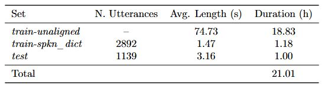

# Speech Transcription Data for the Manx Language

Loayr is a dataset of Manx Gaelic speech recordings, transcriptions and, where available, English translations. By providing this data, we hope to support researchers, developers, and language enthusiasts who want to improve tools and technologies related to the Manx language.

## Why Make Datasets?

Manx language resources are extremely rare compared to most languages, which makes building language technologies challenging. These evaluation sets provide essential benchmarks to consistently measure and enhance the performance of various language technologies. They can be used for:

- **Testing Automatic Speech Recognition (ASR):**  
  Assess and refine tools that convert spoken Manx into written text.

- **Improving Text-to-Speech (TTS):**  
  Develop natural, fluent Manx voices, making the language more accessible.

- **Advancing Speech-to-Text (S2T) and Machine Translation (MT):**  
  Help machines understand and accurately translate spoken or written Manx.

- **Developing Spoken Language Identification (SpokenLID):**  
  Teach systems to recognise Manx, even in mixed-language audio.

## Statistics
Loayr consists of around 20 hours of speech-text data, organised in three subsets. These are:

1. **train_unaligned** 
   - **Description:** Long form audio files. These will eventually be segmented into smaller sentence/utterance like units once the audio can be recognised and transcribed automatically.

2. **train_spkn_dict**  
   - **Description:** Pre-aligned short utterances from a spoken dictionary. Designed as a short training set to teach various models how to recognise Manx.

3. **test**  
   - **Description:** a one-hour test set proportionally sampled from train_unaligned and manually segmented. Contains 'ground-truth' examples designed to test the capabilities of various models.

  

## Where Does the Data Come From?

The evaluation data is organized into five primary sets, each reflecting a distinct style of spoken Manx. For detailed information about each set, refer to their individual README files:

1. [**Lioarlagh** (Books)]  
   - **Style:** Read-speech  
   - **Variety:** Traditional  
   - **Total Duration:** 4.82 hours (train_unaligned), 0.28 hours (test)  
   - **English Translations:** Small subset (~22 minutes)  
   - **Eval Use Cases:** ASR, TTS, S2T (Subset), MT (Subset), SpokenLID  
   - **Description:** Audiobook-style recordings featuring readings of religious texts and folklore. Speech is professionally recorded and generally high-quality. Most texts are transcribed in Manx, with limited English translation available.

2. **Loayrt Rish** (Conversations With)  
   - **Style:** Conversation/interview  
   - **Variety:** Revived  
   - **Total Duration:** 4.36 hours (train_unaligned), 0.27 hours (test)  
   - **English Translations:** Yes  
   - **Eval Use Cases:** ASR, TTS, S2T, MT, SpokenLID  
   - **Description:** Interviews and spontaneous dialogues from various YouTube playlists. Informal speech with occasional overlapping, hesitations, and background noise. Fully transcribed and translated.

3. **Skeealyn Vannin** (Stories of Mann)  
   - **Style:** Conversation/interview  
   - **Variety:** Traditional  
   - **Total Duration:** 3.60 hours (train_unaligned), 0.17 hours (test)  
   - **English Translations:** Yes  
   - **Eval Use Cases:** ASR, TTS, MT, SpokenLID  
   - **Description:** Historical interviews from 1948 featuring native speakers. Audio quality varies due to archival recording methods. Contains speaker overlap and some English. Transcriptions are currently being cleaned and digitized.

4. **Ynsaghey** (Learn)  
   - **Style:** Read-speech  
   - **Variety:** Revived  
   - **Total Duration:** 5.53 hours (train_unaligned), 0.28 hours (test)  
   - **English Translations:** Yes 
   - **Eval Use Cases:** ASR, TTS, S2T (Subset), MT (Subset), SpokenLID  
   - **Description:** A mix of instructional content, including vocabulary lists, cultural materials, and spoken dictionaries. Audio is clear and focused on learner-friendly articulation. Most is transcribed and translated.

5. **Abbyr** (Say)  
   - **Style:** Spoken dictionary  
   - **Variety:** Revived  
   - **Total Duration:** 0.53 hours (train_unaligned), 1.18 hours (train_spkn_dict)  
   - **English Translations:** Yes  
   - **Eval Use Cases:** ASR, TTS, SpokenLID  
   - **Description:** A spoken dictionary derived from educational resources on LearnManx.com. Short utterances with clear pronunciation, typically consisting of isolated words or phrases. Ideal for modeling pronunciation and phoneme-level alignment.

## Licensing and Source Information

Please see metadata.csv for information regarding each file. All data in this repository has been sourced from publicly available sources, however we strive to respect original content creators and maintain any licensing conditions.

## How to Use These Sets

Clone or download this repository to access descriptions and transcripts. The audio files are too large to be hosted directly in this repository, so please contact me personally if you would like access to the recordings.

## Areas for Improvement

This repository is a work in progress. Here are some areas where contributions would be especially valuable:

* Additional Resources: Contributions of Manx text or audio recordings. Speech transcription data is preferable but unlabelled data can also prove useful.
* Correcting Errors: Whilst every effort had been made to ensure that language data is correct, some errors may persist.
* Testing and Feedback: Testing various models against these datasets for continuous improvement, of the models themselves but also of these data.

**Contributions**

We welcome contributions to improve this repository. If you have new resources, corrections, or suggestions, please feel free to submit a pull request or contact me directly at csjbartley1@sheffield.ac.uk.
